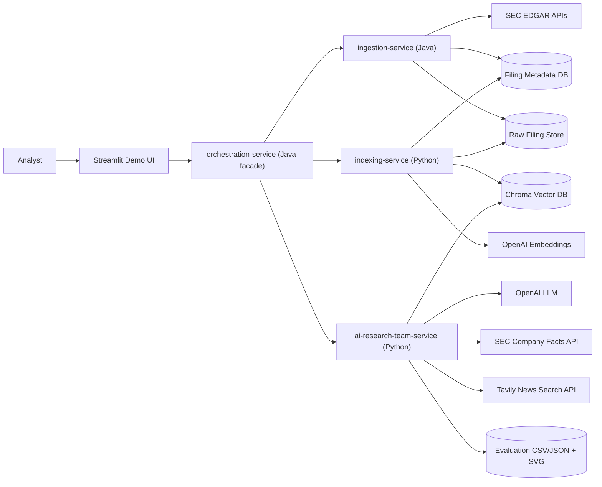
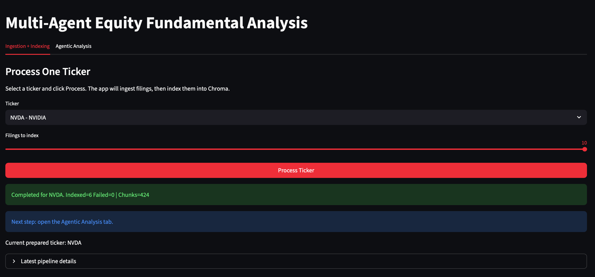
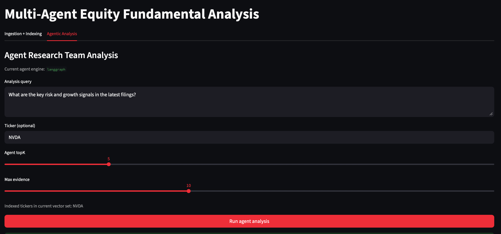
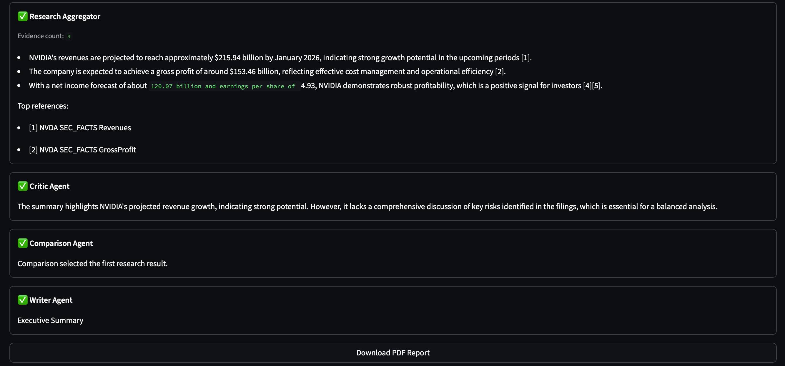
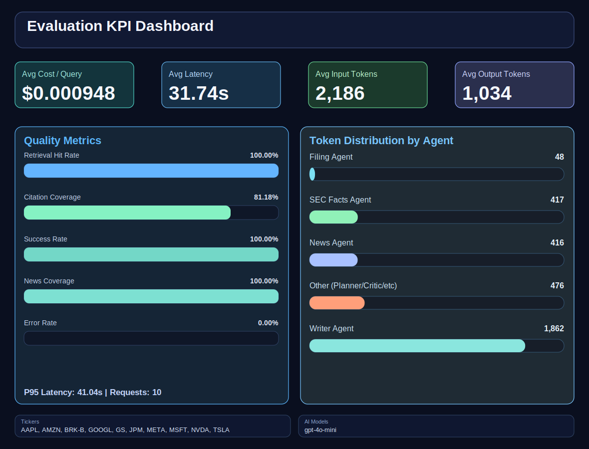
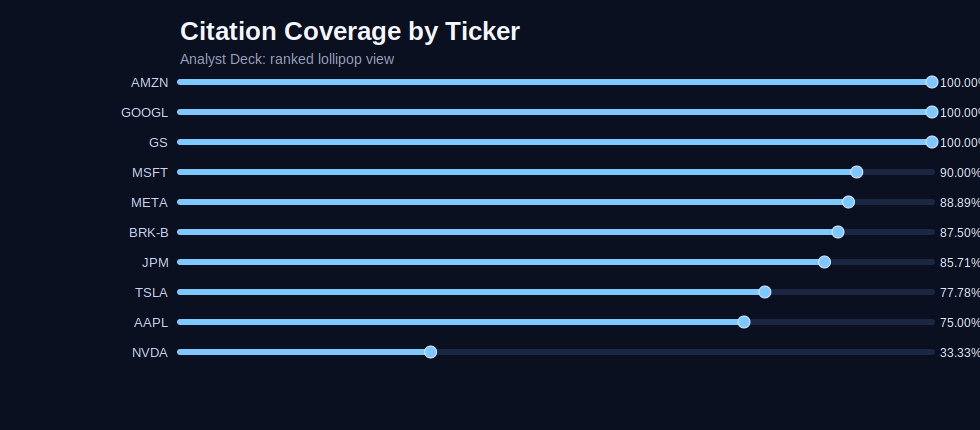
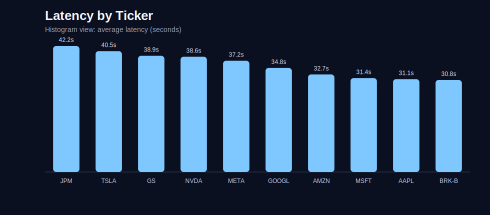
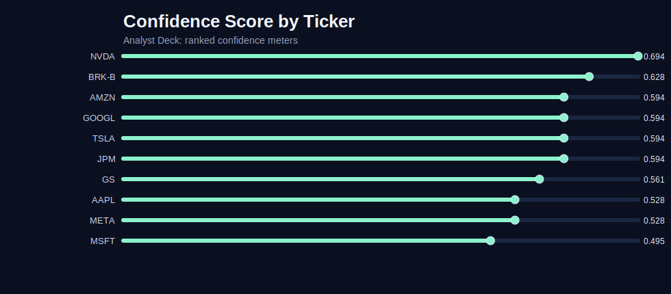
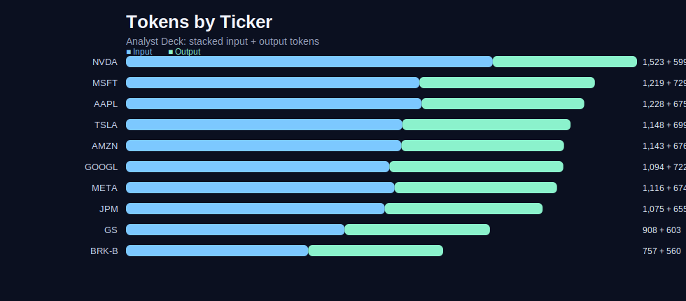

# Multi-Agent Equity Fundamental Analysis

A modular, production-style equity research system that automates filing ingestion, retrieval, and multi-agent analysis to produce grounded investment-style reports with citations, confidence, and measurable evaluation metrics.

## Introduction
Equity fundamental analysis is high-value but time-intensive. Analysts must read large SEC filings, cross-check numeric facts, scan recent market context, and synthesize a clear thesis under time pressure.

Traditional LLM demos help with summarization, but often fail in three critical areas:
- weak grounding in primary sources
- poor transparency into how conclusions were produced
- no measurable quality/cost/latency tracking

This project addresses those gaps with a modular Java + Python architecture and an agentic workflow designed for finance-focused analysis.

## Problem Solved, Why It Matters, and Productivity Impact
### Problem
- Manual filing review is slow and repetitive.
- Evidence is fragmented across filings, SEC facts, and current news.
- Decision quality degrades when outputs are not verifiable.

### How This System Solves It
- Ingests latest filing metadata and raw content.
- Builds searchable vector context from filings.
- Runs a multi-agent research workflow (filings + SEC facts + news).
- Produces a cited report with confidence and full traceability.
- Evaluates outcomes with retrieval, citation, latency, confidence, and token metrics.

### Why It Is Important
- Increases analyst throughput while preserving evidence quality.
- Creates an auditable AI workflow suitable for finance environments.
- Enables engineering conversations around quality gates, cost, and reliability, not just model output.

## Brief Architecture
Main architecture and flow diagrams are documented here:
- [Architecture Diagrams](docs/architecture/architecture-diagrams.md)



## Services and Project Structure
```text
services/
  orchestration-service/      # Java facade for downstream clients
  ingestion-service/          # Java SEC ingestion and filing APIs
  indexing-service/           # Python indexing/chunking/vector APIs
  ai-research-team-service/   # Python LangGraph agentic analysis + evaluation
  demo-ui/                    # Streamlit demo experience

data/
  eval-reports/               # datasets, csv/json summaries, svg assets
  logs/                       # runtime and evaluation logs

docs/
  architecture/architecture-diagrams.md
  architecture/uml-diagrams.md
```

### Agent Team
- Filing Agent: retrieves filing-grounded evidence from vector store.
- SEC Facts Agent: pulls structured company fact context.
- News Agent: retrieves timely market/news context via Tavily.
- Research Aggregator: synthesizes source outputs into one research candidate.
- Critic Agent: scores and validates candidate quality.
- Comparison Agent: selects the best candidate strategy.
- Writer Agent: generates final cited report and memo.

Detailed agentic architecture and sequence flow are in:
- [Architecture Diagrams](docs/architecture/architecture-diagrams.md)

## Key Features
- Modular multi-service architecture (Java facade + Java ingestion + Python AI/indexing).
- LangGraph-based multi-agent workflow with critique and selection.
- Source-grounded evidence retrieval from Chroma.
- SEC Facts + news context enrichment.
- Cited report generation with downloadable PDF.
- Full trace transparency for agent outputs.
- Evaluation framework with metric and visualization outputs.

## Quick Start
### 1) Configure environment
```bash
cd /Users/rohitmacherla/Documents/Projects/equities-research-agent
cp .env.example .env
```

### 2) Start services
```bash
make all-services
make status
```

### 3) Launch demo UI
```bash
make demo-ui
```

### 4) Run evaluation
Single prompt across 10 tickers:
```bash
services/ai-research-team-service/.venv/bin/python \
services/ai-research-team-service/test/run_ten_ticker_eval.py
```

10 prompts across 10 tickers:
```bash
services/ai-research-team-service/.venv/bin/python \
services/ai-research-team-service/test/run_ten_ticker_ten_prompt_eval.py
```

## Demo UI Screenshots

### Indexing Pipeline


### Agentic Analysis


### Result


### Report


📄 **Sample PDF Report:** [NVDA — mefa_NVDA_20260227_195409.pdf](data/results/NVDA/mefa_NVDA_20260227_195409.pdf)

---

## Evaluation Visual Outputs











