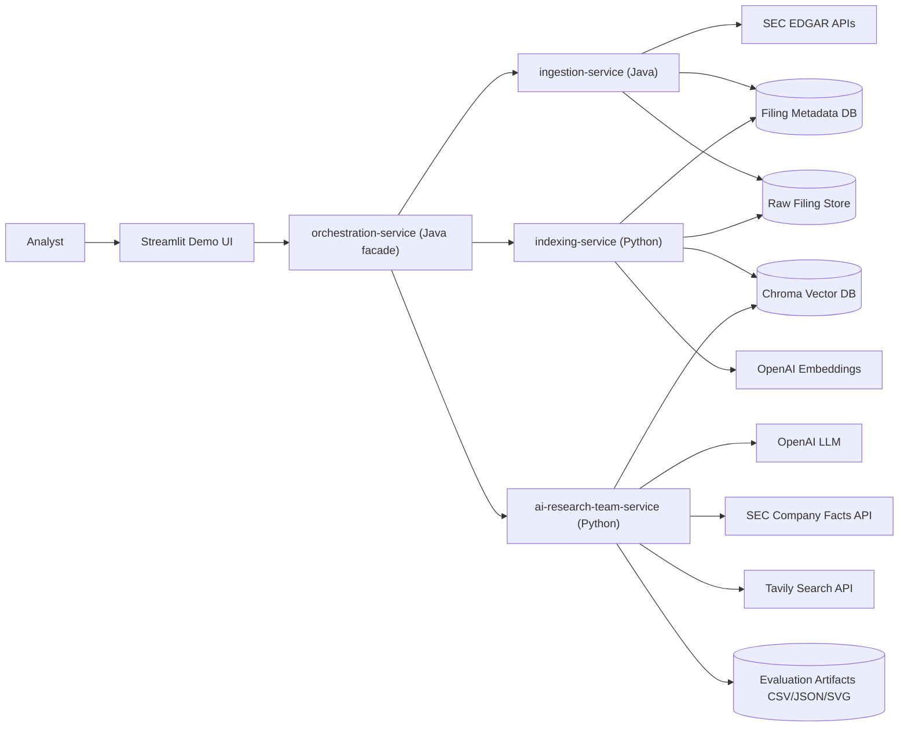
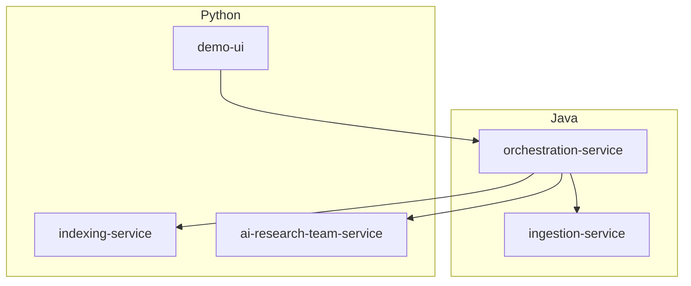
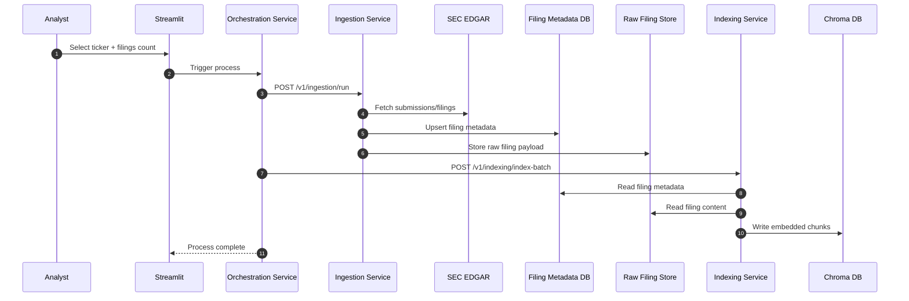
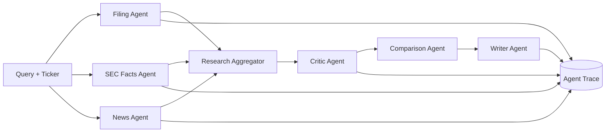
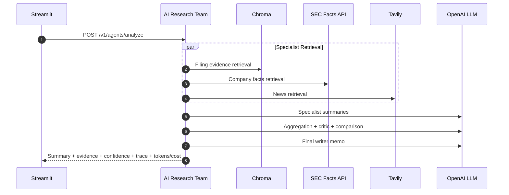
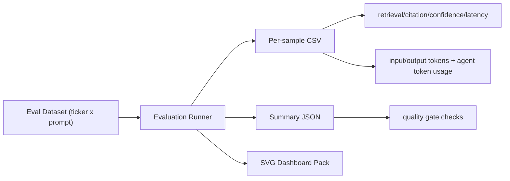
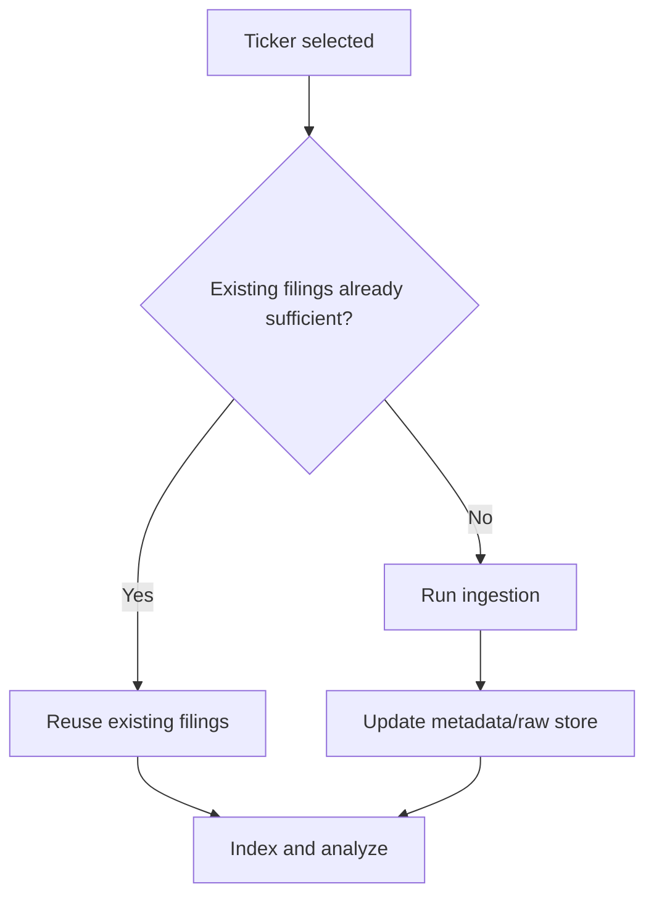

# Architecture Diagrams: Multi-Agent Equity Fundamental Analysis

This document is the one-stop reference for runtime architecture, service boundaries, data flow, and agentic workflow behavior.

## 1) System Context

## 2) Service Boundary View

## 3) Ingestion + Indexing Pipeline

## 4) Agentic Analysis Architecture

## 5) Analysis Request Sequence

## 6) Evaluation and Reporting Flow

## 7) Data Reuse Decision

## 8) Storage Surfaces
- Filing metadata: structured filing/run records used by ingestion and indexing.
- Raw filing store: source payload for chunking/indexing.
- Chroma vector DB: semantic retrieval surface for filing evidence.
- Eval artifacts: dataset/eval CSV/JSON + SVG charts in `data/eval-reports`.
