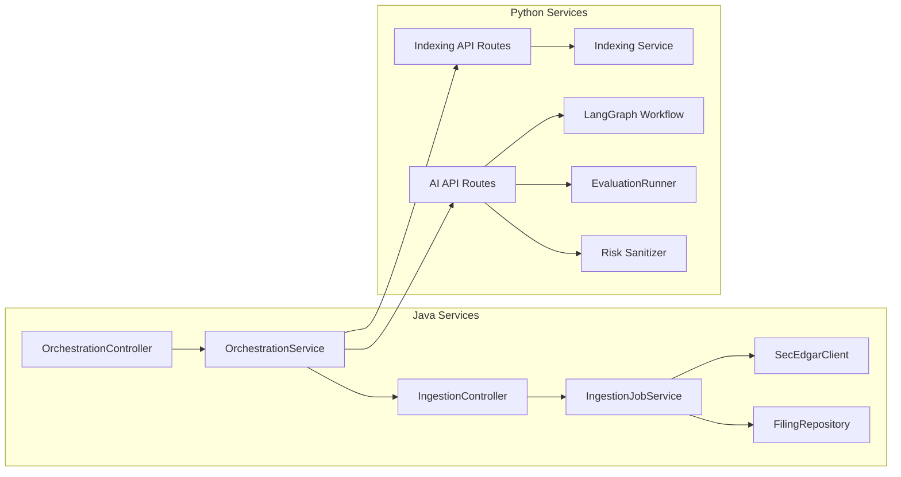
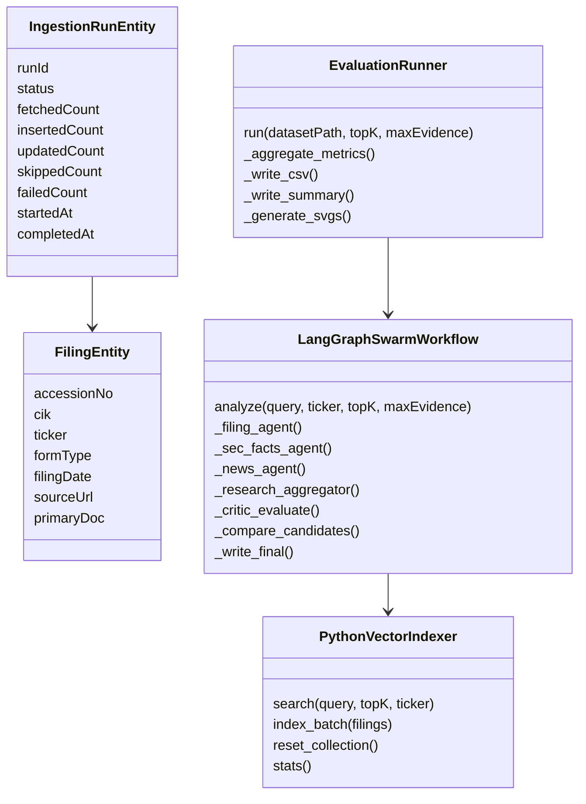
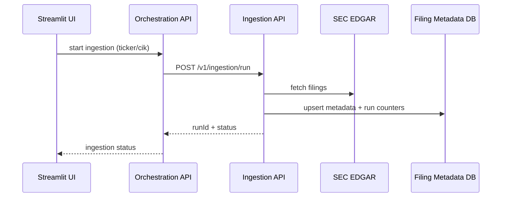
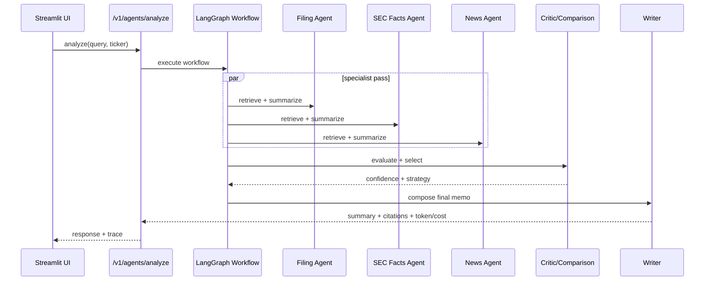
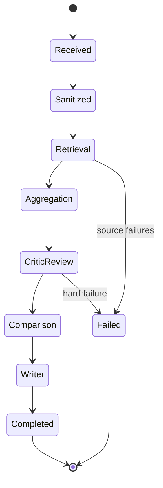

# UML Diagrams: Multi-Agent Equity Fundamental Analysis

This document contains UML diagrams and implementation-oriented UML notes in one place.

## 1) Component Diagram

## 2) Class Diagram

## 3) Sequence Diagram: Ingestion Request

## 4) Sequence Diagram: Agentic Analysis

## 5) State Diagram: Analysis Lifecycle

## 6) UML Implementation Notes

### Package Ownership
- Java ingestion service
  - `controller`, `service`, `client`, `domain`, `repository`, `config`
- Java orchestration service
  - `controller`, `service`, `client`, `domain`, `config`
- Python indexing service
  - `app.main`, `app.routes`, `app.settings`
- Python AI research team service
  - `api`, `agents`, `retrieval`, `risk`, `eval`, `schemas`, `core`
- Streamlit demo UI
  - `services/demo-ui/app.py`

### Runtime Contracts (UML-relevant)
- Ingestion
  - `POST /v1/ingestion/run`
  - `GET /v1/ingestion/runs/{runId}`
  - `GET /v1/filings`
- Indexing
  - `POST /v1/indexing/index-batch`
  - `POST /v1/indexing/reset`
  - `GET /v1/indexing/stats`
- Analysis / Eval
  - `POST /v1/agents/analyze`
  - `POST /v1/eval/run`

### Analysis Object Model
- Research-agent output shape:
  - `count`, `top_items`, `summary_text`, `token_usage`, `estimated_cost_usd`
- Query-level output shape:
  - `summary`, `memo_markdown`, `evidence`, `trace`, `confidence`, `token/cost totals`

### Evaluation Object Model
- Per-sample attributes:
  - `query`, `ticker`, `sanitized_query`, `evidence_count`, `citation_coverage`, `confidence_score`, `latency`
  - `input_tokens`, `output_tokens`, `agent_token_usage_json`, `news_result_count`, `error_message`
- Aggregate summary:
  - retrieval hit rate, citation coverage, confidence, latency, token metrics, quality gate
